### [`pdqbp`](/about.md)

<table><tr><td colspan="2">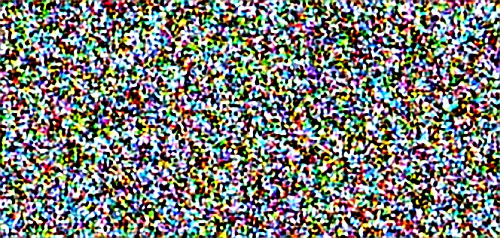</td></tr></tr><tr colspan="2"><tr></tr><td>

```json
{
  "2023-04-22": {
    "data": [
      "birds perched on a tree branch "
    ],
    "duration": 1.577561855316162,
    "average_duration": 4.8553399652180955
  }
}
```
</td><td>

```json
{
  "2023-04-22": {
    "left-region": 4,
    "center-region": 13,
    "right-region": 5,
    "overlap-region": 288,
    "diffusion-steps": 1,
    "random-seed": 2405842210802032
  }
}
```
</td></tr><tr colspan="2"></tr></tr><td colspan="2"><b>iterations</b> : 59</td></table>
<table><tr><td colspan="2">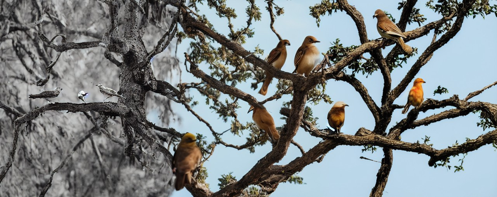</td></tr></tr><tr colspan="2"><tr></tr><td>

```json
{
  "2023-04-21": {
    "data": [
      "two birds perched on a tree branch "
    ],
    "duration": 1.7272982597351074,
    "average_duration": 5.29041948030627
  }
}
```
</td><td>

```json
{
  "2023-04-21": {
    "left-region": 4,
    "center-region": 6,
    "right-region": 10,
    "overlap-region": 152,
    "diffusion-steps": 16,
    "random-seed": 4151373181502317
  }
}
```
</td></tr><tr colspan="2"></tr></tr><td colspan="2"><b>iterations</b> : 58</td></table>
<table><tr><td colspan="2">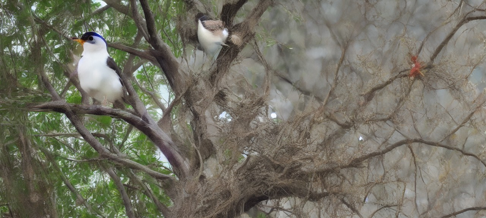</td></tr></tr><tr colspan="2"><tr></tr><td>

```json
{
  "2023-04-20": {
    "data": [
      "a bird perched on a branch in a tree "
    ],
    "duration": 1.7206811904907227,
    "average_duration": 7.030604748287703
  }
}
```
</td><td>

```json
{
  "2023-04-20": {
    "left-region": 6,
    "center-region": 4,
    "right-region": 2,
    "overlap-region": 248,
    "diffusion-steps": 5,
    "random-seed": 8818433925650166
  }
}
```
</td></tr><tr colspan="2"></tr></tr><td colspan="2"><b>iterations</b> : 57</td></table>
<table><tr><td colspan="2"></td></tr></tr><tr colspan="2"><tr></tr><td>

```json
{
  "2023-04-19": {
    "data": [
      "a bird is perched on a branch in a tree "
    ],
    "duration": 1.757389783859253,
    "average_duration": 7.120424430229758
  }
}
```
</td><td>

```json
{
  "2023-04-19": {
    "left-region": 1,
    "center-region": 9,
    "right-region": 8,
    "overlap-region": 248,
    "diffusion-steps": 42,
    "random-seed": 2943971309534371
  }
}
```
</td></tr><tr colspan="2"></tr></tr><td colspan="2"><b>iterations</b> : 56</td></table>
<table><tr><td colspan="2">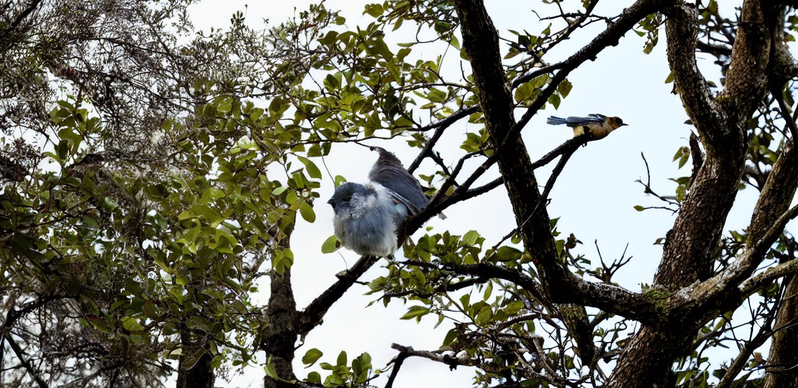</td></tr></tr><tr colspan="2"><tr></tr><td>

```json
{
  "2023-04-18": {
    "data": [
      "a bird perched on a branch in a tree "
    ],
    "duration": 8.297446250915527,
    "average_duration": 7.312656878661894
  }
}
```
</td><td>

```json
{
  "2023-04-18": {
    "left-region": 0,
    "center-region": 4,
    "right-region": 12,
    "overlap-region": 304,
    "diffusion-steps": 29,
    "random-seed": 7096972733498118
  }
}
```
</td></tr><tr colspan="2"></tr></tr><td colspan="2"><b>iterations</b> : 55</td></table>
<table><tr><td colspan="2">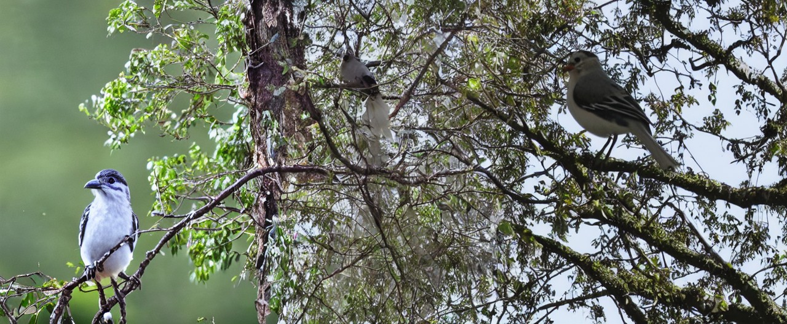</td></tr></tr><tr colspan="2"><tr></tr><td>

```json
{
  "2023-04-17": {
    "data": [
      "a bird perched on a tree branch "
    ],
    "duration": 1.7518305778503418,
    "average_duration": 7.426940542745689
  }
}
```
</td><td>

```json
{
  "2023-04-17": {
    "left-region": 8,
    "center-region": 2,
    "right-region": 9,
    "overlap-region": 184,
    "diffusion-steps": 40,
    "random-seed": 1752888696857148
  }
}
```
</td></tr><tr colspan="2"></tr></tr><td colspan="2"><b>iterations</b> : 54</td></table>
<table><tr><td colspan="2">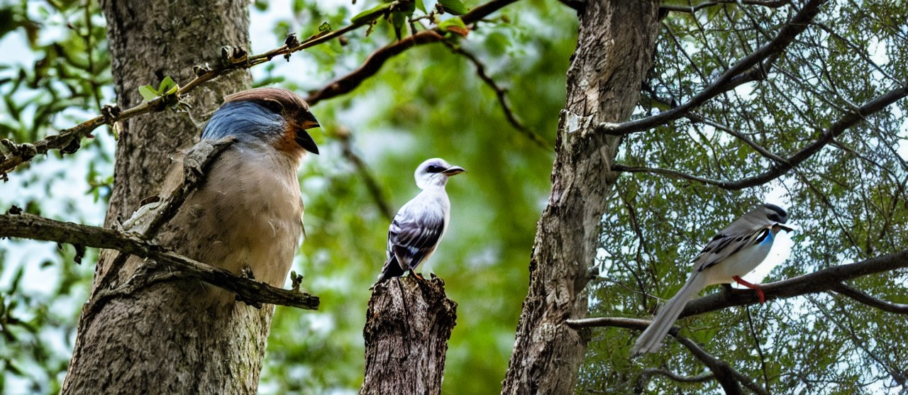</td></tr></tr><tr colspan="2"><tr></tr><td>

```json
{
  "2023-04-16": {
    "data": [
      "a bird perched on a tree branch "
    ],
    "duration": 1.4092366695404053,
    "average_duration": 7.314032350106013
  }
}
```
</td><td>

```json
{
  "2023-04-16": {
    "left-region": 9,
    "center-region": 12,
    "right-region": 11,
    "overlap-region": 224,
    "diffusion-steps": 23,
    "random-seed": 3243184959236319
  }
}
```
</td></tr><tr colspan="2"></tr></tr><td colspan="2"><b>iterations</b> : 53</td></table>
<table><tr><td colspan="2"></td></tr></tr><tr colspan="2"><tr></tr><td>

```json
{
  "2023-04-15": {
    "data": [
      "a bird is standing on a tree branch "
    ],
    "duration": 6.7778000831604,
    "average_duration": 7.553786574828112
  }
}
```
</td><td>

```json
{
  "2023-04-15": {
    "left-region": 7,
    "center-region": 10,
    "right-region": 11,
    "overlap-region": 312,
    "diffusion-steps": 3,
    "random-seed": 6093505369616612
  }
}
```
</td></tr><tr colspan="2"></tr></tr><td colspan="2"><b>iterations</b> : 52</td></table>
<table><tr><td colspan="2">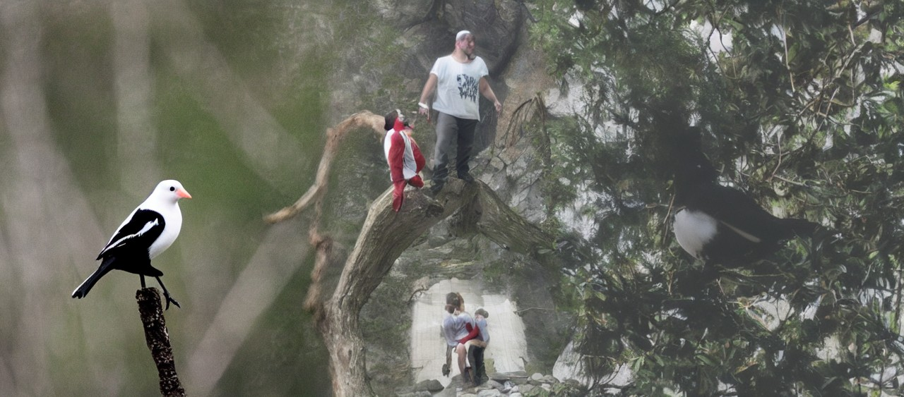</td></tr></tr><tr colspan="2"><tr></tr><td>

```json
{
  "2023-04-14": {
    "data": [
      "a blurry picture of a white and black bird "
    ],
    "duration": 2.0388896465301514,
    "average_duration": 7.916273849002279
  }
}
```
</td><td>

```json
{
  "2023-04-14": {
    "left-region": 12,
    "center-region": 0,
    "right-region": 2,
    "overlap-region": 232,
    "diffusion-steps": 35,
    "random-seed": 1642757866009045
  }
}
```
</td></tr><tr colspan="2"></tr></tr><td colspan="2"><b>iterations</b> : 51</td></table>
<table><tr><td colspan="2">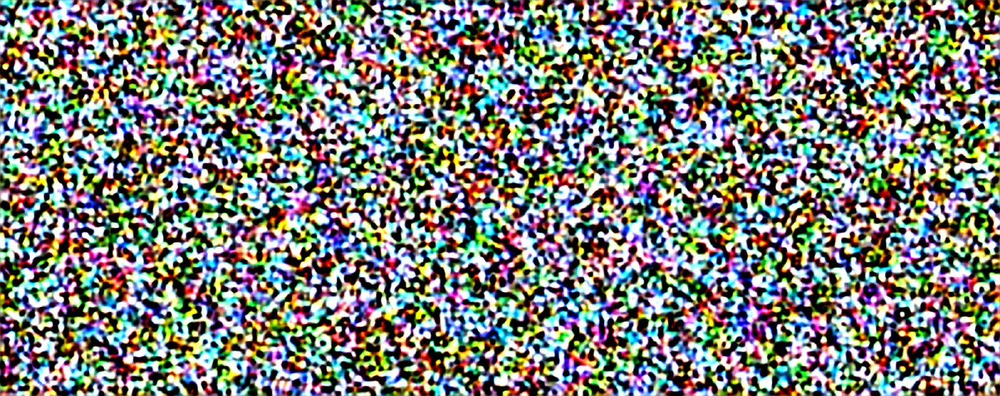</td></tr></tr><tr colspan="2"><tr></tr><td>

```json
{
  "2023-04-13": {
    "data": [
      "a collage of photos of people in a room "
    ],
    "duration": 3.1995584964752197,
    "average_duration": 8.219387176793216
  }
}
```
</td><td>

```json
{
  "2023-04-13": {
    "left-region": 6,
    "center-region": 1,
    "right-region": 12,
    "overlap-region": 152,
    "diffusion-steps": 1,
    "random-seed": 4451491302104711
  }
}
```
</td></tr><tr colspan="2"></tr></tr><td colspan="2"><b>iterations</b> : 50</td></table>
<table><tr><td colspan="2">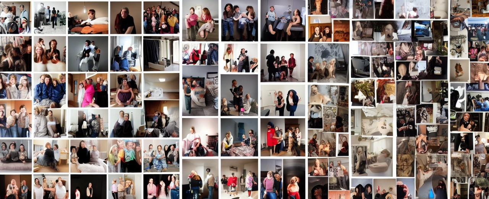</td></tr></tr><tr colspan="2"><tr></tr><td>

```json
{
  "2023-04-12": {
    "data": [
      "a collage of photos of people in a room "
    ],
    "duration": 2.753047466278076,
    "average_duration": 8.369761900170063
  }
}
```
</td><td>

```json
{
  "2023-04-12": {
    "left-region": 11,
    "center-region": 13,
    "right-region": 4,
    "overlap-region": 176,
    "diffusion-steps": 29,
    "random-seed": 4464088888616686
  }
}
```
</td></tr><tr colspan="2"></tr></tr><td colspan="2"><b>iterations</b> : 49</td></table>
<table><tr><td colspan="2">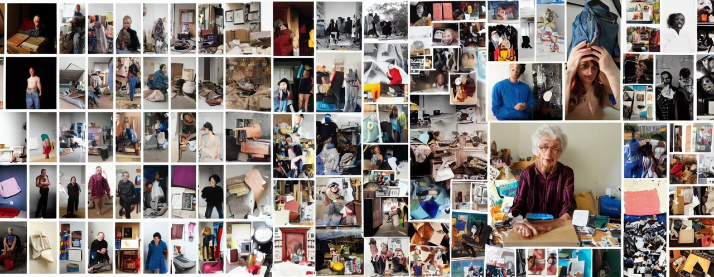</td></tr></tr><tr colspan="2"><tr></tr><td>

```json
{
  "2023-04-11": {
    "data": [
      "a collage of photos of people and their belongings "
    ],
    "duration": 1.955420970916748,
    "average_duration": 8.773477273914473
  }
}
```
</td><td>

```json
{
  "2023-04-11": {
    "left-region": 14,
    "center-region": 6,
    "right-region": 7,
    "overlap-region": 136,
    "diffusion-steps": 40,
    "random-seed": 7968617191120279
  }
}
```
</td></tr><tr colspan="2"></tr></tr><td colspan="2"><b>iterations</b> : 48</td></table>
<table><tr><td colspan="2">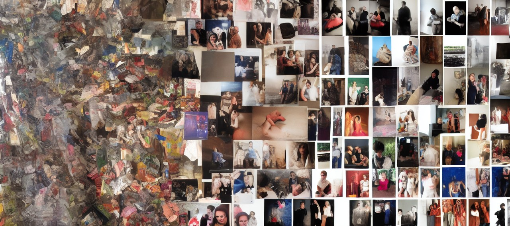</td></tr></tr><tr colspan="2"><tr></tr><td>

```json
{
  "2023-04-10": {
    "data": [
      "a collage of photos of people in a room "
    ],
    "duration": 2.146709442138672,
    "average_duration": 9.98747922414561
  }
}
```
</td><td>

```json
{
  "2023-04-10": {
    "left-region": 0,
    "center-region": 8,
    "right-region": 11,
    "overlap-region": 240,
    "diffusion-steps": 7,
    "random-seed": 4976508621443453
  }
}
```
</td></tr><tr colspan="2"></tr></tr><td colspan="2"><b>iterations</b> : 47</td></table>
<table><tr><td colspan="2"></td></tr></tr><tr colspan="2"><tr></tr><td>

```json
{
  "2023-04-09": {
    "data": [
      "a collage of photos of people in a variety of poses "
    ],
    "duration": 31.467409372329712,
    "average_duration": 12.477760095797606
  }
}
```
</td><td>

```json
{
  "2023-04-09": {
    "left-region": 6,
    "center-region": 3,
    "right-region": 14,
    "overlap-region": 224,
    "diffusion-steps": 35,
    "random-seed": 6447096969578712
  }
}
```
</td></tr><tr colspan="2"></tr></tr><td colspan="2"><b>iterations</b> : 46</td></table>
<table><tr><td colspan="2">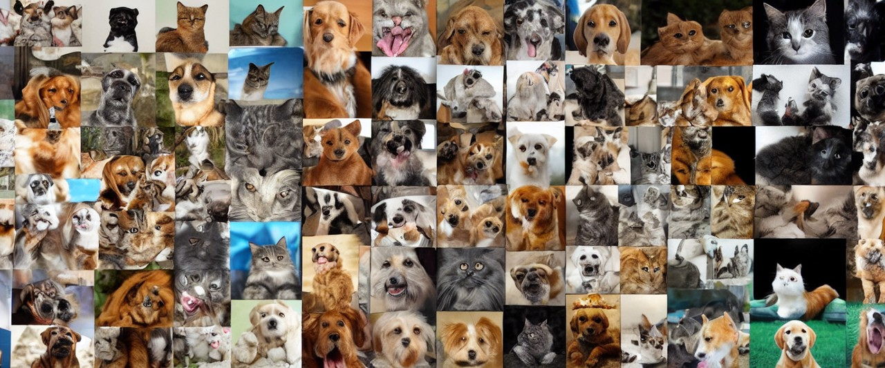</td></tr></tr><tr colspan="2"><tr></tr><td>

```json
{
  "2023-04-08": {
    "data": [
      "a collage of photos of dogs and cats "
    ],
    "duration": 5.171021461486816,
    "average_duration": 14.551849078037048
  }
}
```
</td><td>

```json
{
  "2023-04-08": {
    "left-region": 5,
    "center-region": 4,
    "right-region": 4,
    "overlap-region": 192,
    "diffusion-steps": 33,
    "random-seed": 6803276427508713
  }
}
```
</td></tr><tr colspan="2"></tr></tr><td colspan="2"><b>iterations</b> : 45</td></table>
<table><tr><td colspan="2"></td></tr></tr><tr colspan="2"><tr></tr><td>

```json
{
  "2023-04-07": {
    "data": [
      "a collage of photos of dogs and their owners "
    ],
    "duration": 8.792436122894287,
    "average_duration": 16.598918764856492
  }
}
```
</td><td>

```json
{
  "2023-04-07": {
    "left-region": 3,
    "center-region": 3,
    "right-region": 10,
    "overlap-region": 240,
    "diffusion-steps": 29,
    "random-seed": 7560753605058879
  }
}
```
</td></tr><tr colspan="2"></tr></tr><td colspan="2"><b>iterations</b> : 44</td></table>
<table><tr><td colspan="2">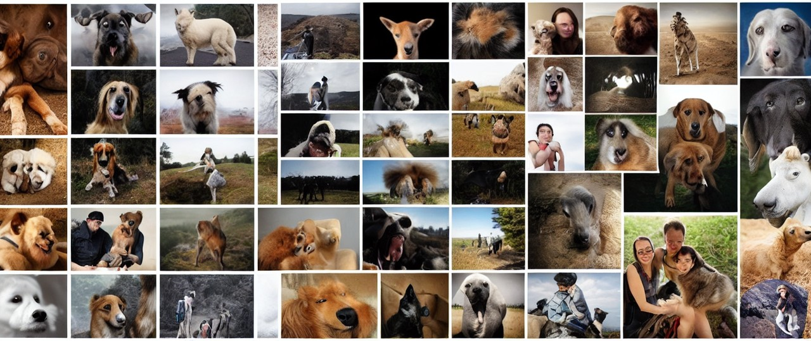</td></tr></tr><tr colspan="2"><tr></tr><td>

```json
{
  "2023-04-06": {
    "data": [
      "a collage of photos of people and animals "
    ],
    "duration": 2.076085090637207,
    "average_duration": 18.64594996043099
  }
}
```
</td><td>

```json
{
  "2023-04-06": {
    "left-region": 8,
    "center-region": 10,
    "right-region": 9,
    "overlap-region": 200,
    "diffusion-steps": 24,
    "random-seed": 7448890498666677
  }
}
```
</td></tr><tr colspan="2"></tr></tr><td colspan="2"><b>iterations</b> : 43</td></table>
<table><tr><td colspan="2"></td></tr></tr><tr colspan="2"><tr></tr><td>

```json
{
  "2023-04-05": {
    "data": [
      "a collage of photos of people in a park "
    ],
    "duration": 1.9667770862579346,
    "average_duration": 3.43898970893033
  }
}
```
</td><td>

```json
{
  "2023-04-05": {
    "left-region": 0,
    "center-region": 12,
    "right-region": 4,
    "overlap-region": 232,
    "diffusion-steps": 5,
    "random-seed": 7135282964710318
  }
}
```
</td></tr><tr colspan="2"></tr></tr><td colspan="2"><b>iterations</b> : 42</td></table>
<table><tr><td colspan="2">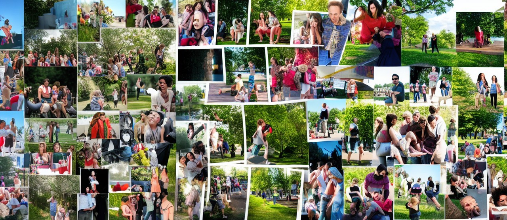</td></tr></tr><tr colspan="2"><tr></tr><td>

```json
{
  "2023-04-04": {
    "data": [
      "a collage of photos of people in a park "
    ],
    "duration": 1.8481218814849854,
    "average_duration": 3.4338364986229872
  }
}
```
</td><td>

```json
{
  "2023-04-04": {
    "left-region": 4,
    "center-region": 10,
    "right-region": 9,
    "overlap-region": 224,
    "diffusion-steps": 10,
    "random-seed": 44767497210485
  }
}
```
</td></tr><tr colspan="2"></tr></tr><td colspan="2"><b>iterations</b> : 41</td></table>
<table><tr><td colspan="2">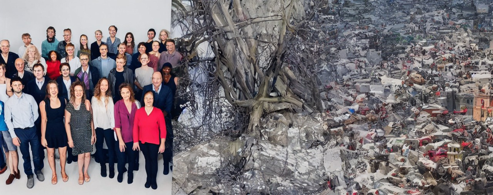</td></tr></tr><tr colspan="2"><tr></tr><td>

```json
{
  "2023-04-03": {
    "data": [
      "a group of people standing together in a room "
    ],
    "duration": 1.4133291244506836,
    "average_duration": 3.4971726617639747
  }
}
```
</td><td>

```json
{
  "2023-04-03": {
    "left-region": 10,
    "center-region": 0,
    "right-region": 0,
    "overlap-region": 152,
    "diffusion-steps": 47,
    "random-seed": 7234081487995200
  }
}
```
</td></tr><tr colspan="2"></tr></tr><td colspan="2"><b>iterations</b> : 40</td></table>
<table><tr><td colspan="2"></td></tr></tr><tr colspan="2"><tr></tr><td>

```json
{
  "2023-04-02": {
    "data": [
      "a woman and a man standing next to each other "
    ],
    "duration": 1.7745952606201172,
    "average_duration": 3.5590133313096635
  }
}
```
</td><td>

```json
{
  "2023-04-02": {
    "left-region": 5,
    "center-region": 13,
    "right-region": 12,
    "overlap-region": 136,
    "diffusion-steps": 40,
    "random-seed": 1329592526878842
  }
}
```
</td></tr><tr colspan="2"></tr></tr><td colspan="2"><b>iterations</b> : 39</td></table>
<table><tr><td colspan="2">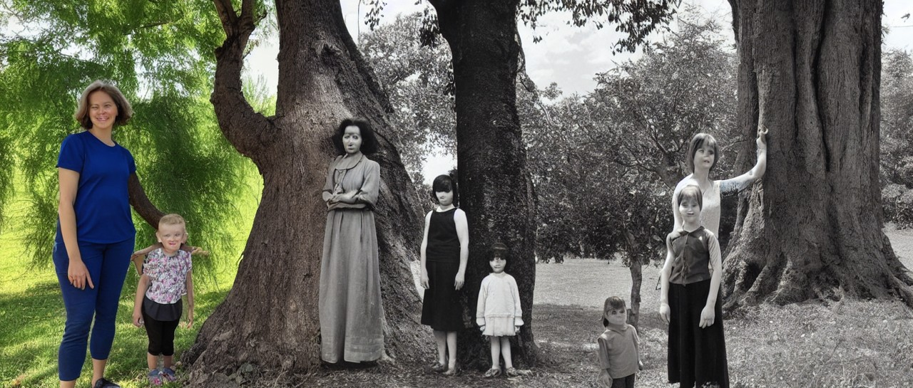</td></tr></tr><tr colspan="2"><tr></tr><td>

```json
{
  "2023-04-01": {
    "data": [
      "a woman and a child standing next to a tree "
    ],
    "duration": 1.7554197311401367,
    "average_duration": 3.5389639009894975
  }
}
```
</td><td>

```json
{
  "2023-04-01": {
    "left-region": 10,
    "center-region": 11,
    "right-region": 9,
    "overlap-region": 208,
    "diffusion-steps": 22,
    "random-seed": 3125029598797873
  }
}
```
</td></tr><tr colspan="2"></tr></tr><td colspan="2"><b>iterations</b> : 38</td></table>
<table><tr><td colspan="2">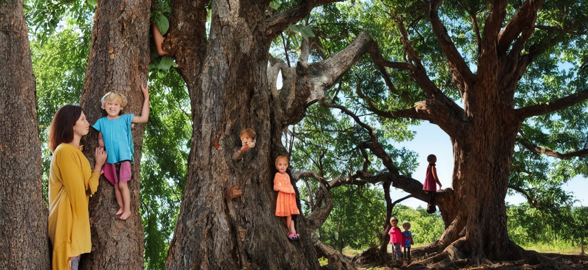</td></tr></tr><tr colspan="2"><tr></tr><td>

```json
{
  "2023-03-31": {
    "data": [
      "a woman and a child are standing in a tree "
    ],
    "duration": 1.991511583328247,
    "average_duration": 3.4276203294694834
  }
}
```
</td><td>

```json
{
  "2023-03-31": {
    "left-region": 11,
    "center-region": 5,
    "right-region": 13,
    "overlap-region": 264,
    "diffusion-steps": 30,
    "random-seed": 7900534364946759
  }
}
```
</td></tr><tr colspan="2"></tr></tr><td colspan="2"><b>iterations</b> : 37</td></table>
<table><tr><td colspan="2"></td></tr></tr><tr colspan="2"><tr></tr><td>

```json
{
  "2023-03-30": {
    "data": [
      "a painting of a tree with a painting of a person "
    ],
    "duration": 1.9438633918762207,
    "average_duration": 3.2248703101509935
  }
}
```
</td><td>

```json
{
  "2023-03-30": {
    "left-region": 10,
    "center-region": 9,
    "right-region": 12,
    "overlap-region": 224,
    "diffusion-steps": 10,
    "random-seed": 6161741276182180
  }
}
```
</td></tr><tr colspan="2"></tr></tr><td colspan="2"><b>iterations</b> : 36</td></table>
<table><tr><td colspan="2"></td></tr></tr><tr colspan="2"><tr></tr><td>

```json
{
  "2023-03-29": {
    "data": [
      "a painting of a tree filled with colorful flowers "
    ],
    "duration": 3.1651434898376465,
    "average_duration": 3.28467325897653
  }
}
```
</td><td>

```json
{
  "2023-03-29": {
    "left-region": 3,
    "center-region": 3,
    "right-region": 14,
    "overlap-region": 224,
    "diffusion-steps": 39,
    "random-seed": 5498598061457202
  }
}
```
</td></tr><tr colspan="2"></tr></tr><td colspan="2"><b>iterations</b> : 35</td></table>
<table><tr><td colspan="2"></td></tr></tr><tr colspan="2"><tr></tr><td>

```json
{
  "2023-03-28": {
    "data": [
      "a painting of birds on a tree "
    ],
    "duration": 1.6712684631347656,
    "average_duration": 2.8828126759914303
  }
}
```
</td><td>

```json
{
  "2023-03-28": {
    "left-region": 13,
    "center-region": 8,
    "right-region": 10,
    "overlap-region": 136,
    "diffusion-steps": 8,
    "random-seed": 4408333879471387
  }
}
```
</td></tr><tr colspan="2"></tr></tr><td colspan="2"><b>iterations</b> : 34</td></table>
<table><tr><td colspan="2">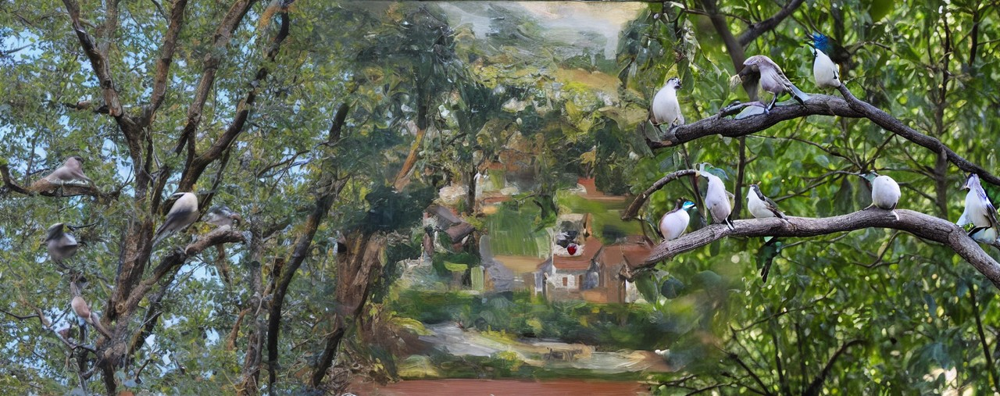</td></tr></tr><tr colspan="2"><tr></tr><td>

```json
{
  "2023-03-27": {
    "data": [
      "birds perched on a tree branch "
    ],
    "duration": 1.4686319828033447,
    "average_duration": 2.8614393685352595
  }
}
```
</td><td>

```json
{
  "2023-03-27": {
    "left-region": 3,
    "center-region": 0,
    "right-region": 11,
    "overlap-region": 152,
    "diffusion-steps": 10,
    "random-seed": 486363512942935
  }
}
```
</td></tr><tr colspan="2"></tr></tr><td colspan="2"><b>iterations</b> : 33</td></table>
<table><tr><td colspan="2"></td></tr></tr><tr colspan="2"><tr></tr><td>

```json
{
  "2023-03-26": {
    "data": [
      "birds perched on top of a tree "
    ],
    "duration": 1.4799623489379883,
    "average_duration": 2.8244388917715346
  }
}
```
</td><td>

```json
{
  "2023-03-26": {
    "left-region": 14,
    "center-region": 7,
    "right-region": 5,
    "overlap-region": 136,
    "diffusion-steps": 32,
    "random-seed": 6320707115727154
  }
}
```
</td></tr><tr colspan="2"></tr></tr><td colspan="2"><b>iterations</b> : 32</td></table>
<table><tr><td colspan="2"></td></tr></tr><tr colspan="2"><tr></tr><td>

```json
{
  "2023-03-25": {
    "data": [
      "birds perched on a tree branch "
    ],
    "duration": 1.3612475395202637,
    "average_duration": 2.9467003023234715
  }
}
```
</td><td>

```json
{
  "2023-03-25": {
    "left-region": 12,
    "center-region": 10,
    "right-region": 13,
    "overlap-region": 192,
    "diffusion-steps": 9,
    "random-seed": 3745584436573514
  }
}
```
</td></tr><tr colspan="2"></tr></tr><td colspan="2"><b>iterations</b> : 31</td></table>
<table><tr><td colspan="2">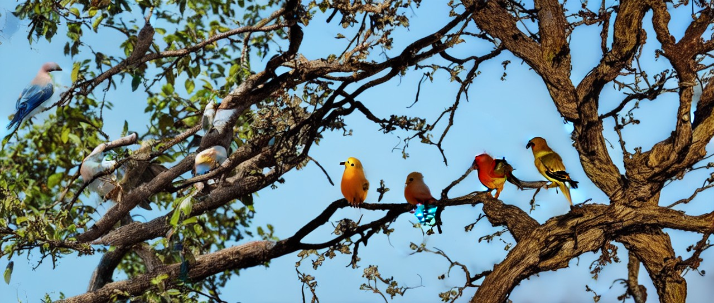</td></tr></tr><tr colspan="2"><tr></tr><td>

```json
{
  "2023-03-24": {
    "data": [
      "two birds perched on a branch in a tree "
    ],
    "duration": 1.5223071575164795,
    "average_duration": 3.1720176579603647
  }
}
```
</td><td>

```json
{
  "2023-03-24": {
    "left-region": 7,
    "center-region": 11,
    "right-region": 13,
    "overlap-region": 208,
    "diffusion-steps": 10,
    "random-seed": 7830078551494984
  }
}
```
</td></tr><tr colspan="2"></tr></tr><td colspan="2"><b>iterations</b> : 30</td></table>
<table><tr><td colspan="2">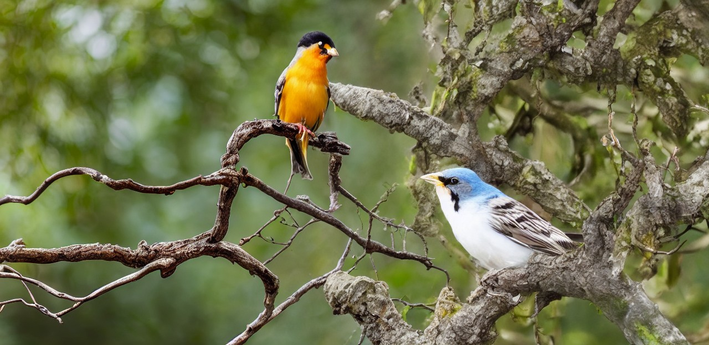</td></tr></tr><tr colspan="2"><tr></tr><td>

```json
{
  "2023-03-23": {
    "data": [
      "a bird perched on a branch with a tree "
    ],
    "duration": 2.0726325511932373,
    "average_duration": 3.4652992784092618
  }
}
```
</td><td>

```json
{
  "2023-03-23": {
    "left-region": 11,
    "center-region": 5,
    "right-region": 3,
    "overlap-region": 304,
    "diffusion-steps": 34,
    "random-seed": 2262185738629467
  }
}
```
</td></tr><tr colspan="2"></tr></tr><td colspan="2"><b>iterations</b> : 29</td></table>
<table><tr><td colspan="2"></td></tr></tr><tr colspan="2"><tr></tr><td>

```json
{
  "2023-03-22": {
    "data": [
      "a blurry picture of a white and black bird "
    ],
    "duration": 1.9292473793029785,
    "average_duration": 2.1241919960791673
  }
}
```
</td><td>

```json
{
  "2023-03-22": {
    "left-region": 0,
    "center-region": 11,
    "right-region": 11,
    "overlap-region": 272,
    "diffusion-steps": 20,
    "random-seed": 8444683230166684
  }
}
```
</td></tr><tr colspan="2"></tr></tr><td colspan="2"><b>iterations</b> : 28</td></table>
<table><tr><td colspan="2">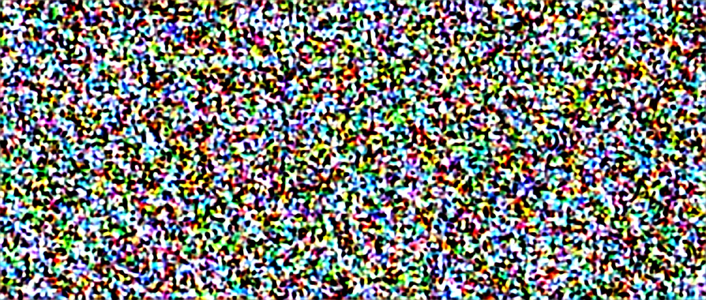</td></tr></tr><tr colspan="2"><tr></tr><td>

```json
{
  "2023-03-21": {
    "data": [
      "a blue door leading to a blue room with a blue wall "
    ],
    "duration": 2.263767957687378,
    "average_duration": 2.19107794591088
  }
}
```
</td><td>

```json
{
  "2023-03-21": {
    "left-region": 14,
    "center-region": 4,
    "right-region": 7,
    "overlap-region": 208,
    "diffusion-steps": 1,
    "random-seed": 1536552627542229
  }
}
```
</td></tr><tr colspan="2"></tr></tr><td colspan="2"><b>iterations</b> : 27</td></table>
<table><tr><td colspan="2"></td></tr></tr><tr colspan="2"><tr></tr><td>

```json
{
  "2023-03-20": {
    "data": [
      "a blue door leading to a blue door with a blue door "
    ],
    "duration": 2.1595778465270996,
    "average_duration": 1.7858084349231866
  }
}
```
</td><td>

```json
{
  "2023-03-20": {
    "left-region": 1,
    "center-region": 9,
    "right-region": 4,
    "overlap-region": 256,
    "diffusion-steps": 15,
    "random-seed": 5755203652203745
  }
}
```
</td></tr><tr colspan="2"></tr></tr><td colspan="2"><b>iterations</b> : 26</td></table>
<table><tr><td colspan="2"></td></tr></tr><tr colspan="2"><tr></tr><td>

```json
{
  "2023-03-19": {
    "data": [
      "a small building with a white door and a blue building "
    ],
    "duration": 2.200101375579834,
    "average_duration": 6.895642589913668
  }
}
```
</td><td>

```json
{
  "2023-03-19": {
    "left-region": 11,
    "center-region": 5,
    "right-region": 13,
    "overlap-region": 208,
    "diffusion-steps": 34,
    "random-seed": 6318008325277304
  }
}
```
</td></tr><tr colspan="2"></tr></tr><td colspan="2"><b>iterations</b> : 25</td></table>
<table><tr><td colspan="2"></td></tr></tr><tr colspan="2"><tr></tr><td>

```json
{
  "2023-03-18": {
    "data": [
      "a house with a large window and a small building "
    ],
    "duration": 8.910776376724243,
    "average_duration": 6.854453844961777
  }
}
```
</td><td>

```json
{
  "2023-03-18": {
    "left-region": 11,
    "center-region": 2,
    "right-region": 14,
    "overlap-region": 200,
    "diffusion-steps": 10,
    "random-seed": 8312629788129159
  }
}
```
</td></tr><tr colspan="2"></tr></tr><td colspan="2"><b>iterations</b> : 24</td></table>
<table><tr><td colspan="2"></td></tr></tr><tr colspan="2"><tr></tr><td>

```json
{
  "2023-03-17": {
    "data": [
      "a abandoned abandoned house with a broken tree "
    ],
    "duration": 2.5602333545684814,
    "average_duration": 18.514892001305856
  }
}
```
</td><td>

```json
{
  "2023-03-17": {
    "left-region": 7,
    "center-region": 7,
    "right-region": 7,
    "overlap-region": 184,
    "diffusion-steps": 33,
    "random-seed": 1224266878921517
  }
}
```
</td></tr><tr colspan="2"></tr></tr><td colspan="2"><b>iterations</b> : 23</td></table>
<table><tr><td colspan="2">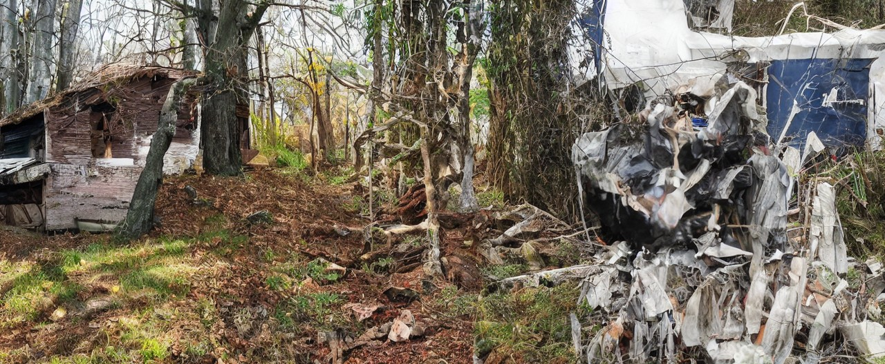</td></tr></tr><tr colspan="2"><tr></tr><td>

```json
{
  "2023-03-16": {
    "data": [
      "two people are playing a game of wii "
    ],
    "duration": 4.589929580688477,
    "average_duration": 7.841220573381544
  }
}
```
</td><td>

```json
{
  "2023-03-16": {
    "left-region": 0,
    "center-region": 0,
    "right-region": 0,
    "overlap-region": 184,
    "diffusion-steps": 32,
    "random-seed": 7147213
  }
}
```
</td></tr><tr colspan="2"></tr></tr><td colspan="2"><b>iterations</b> : 22</td></table>
<table><tr><td colspan="2"></td></tr></tr><tr colspan="2"><tr></tr><td>

```json
{
  "2023-03-15": {
    "data": [
      "a painting of a man riding a skateboard "
    ],
    "duration": 10.962588787078857,
    "average_duration": 7.205140010411933
  }
}
```
</td><td>

```json
{
  "2023-03-15": {
    "left-region": 2,
    "center-region": 2,
    "right-region": 2,
    "overlap-region": 152,
    "diffusion-steps": 48,
    "random-seed": 8711528
  }
}
```
</td></tr><tr colspan="2"></tr></tr><td colspan="2"><b>iterations</b> : 21</td></table>
<table><tr><td colspan="2"></td></tr></tr><tr colspan="2"><tr></tr><td>

```json
{
  "2023-03-14": {
    "data": [
      "a man walking through a forest with a bunch of snow "
    ],
    "duration": 3.526684284210205,
    "average_duration": 6.82038748099659
  }
}
```
</td><td>

```json
{
  "2023-03-14": {
    "left-region": 0,
    "center-region": 0,
    "right-region": 0,
    "overlap-region": 224,
    "diffusion-steps": 8,
    "random-seed": 9508181
  }
}
```
</td></tr><tr colspan="2"></tr></tr><td colspan="2"><b>iterations</b> : 20</td></table>
<table><tr><td colspan="2"></td></tr></tr><tr colspan="2"><tr></tr><td>

```json
{
  "2023-03-13": {
    "data": [
      "two men are fixing a pipe in a building "
    ],
    "duration": 5.191164016723633,
    "average_duration": 7.427327733274568
  }
}
```
</td><td>

```json
{
  "2023-03-13": {
    "left-region": 2,
    "center-region": 2,
    "right-region": 2,
    "overlap-region": 232,
    "diffusion-steps": 4,
    "random-seed": 3243668
  }
}
```
</td></tr><tr colspan="2"></tr></tr><td colspan="2"><b>iterations</b> : 19</td></table>
<table><tr><td colspan="2"></td></tr></tr><tr colspan="2"><tr></tr><td>

```json
{
  "2023-03-12": {
    "data": [
      "a man is fixing a pipe on a wall "
    ],
    "duration": 5.678689241409302,
    "average_duration": 6.616457512680913
  }
}
```
</td><td>

```json
{
  "2023-03-12": {
    "left-region": 6,
    "center-region": 6,
    "right-region": 6,
    "overlap-region": 192,
    "diffusion-steps": 22,
    "random-seed": 4156916
  }
}
```
</td></tr><tr colspan="2"></tr></tr><td colspan="2"><b>iterations</b> : 18</td></table>
<table><tr><td colspan="2"></td></tr></tr><tr colspan="2"><tr></tr><td>

```json
{
  "2023-03-11": {
    "data": [
      "a man is fixing a wall with a hose "
    ],
    "duration": 4.514027118682861,
    "average_duration": 4.813878398768756
  }
}
```
</td><td>

```json
{
  "2023-03-11": {
    "left-region": 6,
    "center-region": 6,
    "right-region": 6,
    "overlap-region": 224,
    "diffusion-steps": 48,
    "random-seed": 4656187
  }
}
```
</td></tr><tr colspan="2"></tr></tr><td colspan="2"><b>iterations</b> : 17</td></table>
<table><tr><td colspan="2"></td></tr></tr><tr colspan="2"><tr></tr><td>

```json
{
  "2023-03-10": {
    "data": [
      "a man is painting a wall in front of a house "
    ],
    "duration": 5.437368869781494,
    "average_duration": 11.478159784392453
  }
}
```
</td><td>

```json
{
  "2023-03-10": {
    "left-region": 6,
    "center-region": 6,
    "right-region": 6,
    "overlap-region": 312,
    "diffusion-steps": 33,
    "random-seed": 2493033
  }
}
```
</td></tr><tr colspan="2"></tr></tr><td colspan="2"><b>iterations</b> : 16</td></table>
<table><tr><td colspan="2">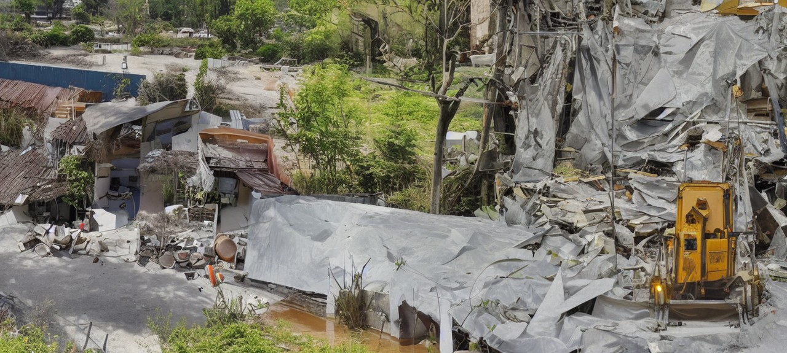</td></tr></tr><tr colspan="2"><tr></tr><td>

```json
{
  "2023-03-09": {
    "data": [
      "a pile of trash sitting on top of a pile of trees "
    ],
    "duration": 5.59853458404541,
    "average_duration": 12.465352371844956
  }
}
```
</td><td>

```json
{
  "2023-03-09": {
    "left-region": 0,
    "center-region": 0,
    "right-region": 0,
    "overlap-region": 248,
    "diffusion-steps": 11,
    "random-seed": 9631383
  }
}
```
</td></tr><tr colspan="2"></tr></tr><td colspan="2"><b>iterations</b> : 15</td></table>
<table><tr><td colspan="2">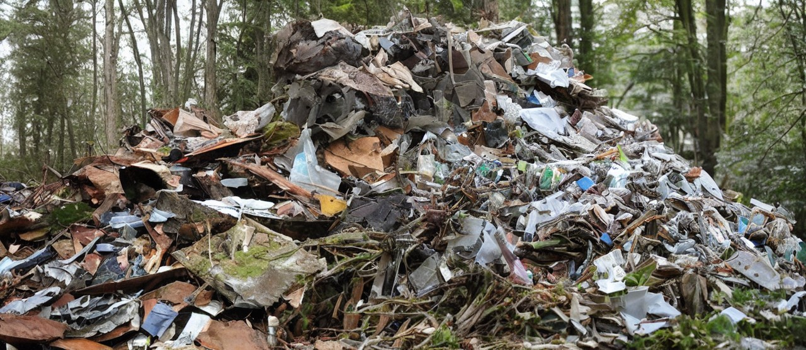</td></tr></tr><tr colspan="2"><tr></tr><td>

```json
{
  "2023-03-08": {
    "data": [
      "a pile of debris sitting on top of a pile of trees "
    ],
    "duration": 4.874717473983765,
    "average_duration": 13.878840092884047
  }
}
```
</td><td>

```json
{
  "2023-03-08": {
    "left-region": 2,
    "center-region": 2,
    "right-region": 2,
    "overlap-region": 224,
    "diffusion-steps": 17,
    "random-seed": 2009852
  }
}
```
</td></tr><tr colspan="2"></tr></tr><td colspan="2"><b>iterations</b> : 14</td></table>
<table><tr><td colspan="2"></td></tr></tr><tr colspan="2"><tr></tr><td>

```json
{
  "2023-03-07": {
    "data": [
      "a crowd of people standing around a crowd of people "
    ],
    "duration": 10.221726655960083,
    "average_duration": 16.2154255130984
  }
}
```
</td><td>

```json
{
  "2023-03-07": {
    "left-region": 0,
    "center-region": 0,
    "right-region": 0,
    "overlap-region": 160,
    "diffusion-steps": 13,
    "random-seed": 4513933
  }
}
```
</td></tr><tr colspan="2"></tr></tr><td colspan="2"><b>iterations</b> : 13</td></table>
<table><tr><td colspan="2"></td></tr></tr><tr colspan="2"><tr></tr><td>

```json
{
  "2023-03-06": {
    "data": [
      "a crowd of people standing around a large group of people "
    ],
    "duration": 5.207799673080444,
    "average_duration": 5.520513468600334
  }
}
```
</td><td>

```json
{
  "2023-03-06": {
    "left-region": 5,
    "center-region": 5,
    "right-region": 5,
    "overlap-region": 272,
    "diffusion-steps": 11,
    "random-seed": 5387457
  }
}
```
</td></tr><tr colspan="2"></tr></tr><td colspan="2"><b>iterations</b> : 12</td></table>
<table><tr><td colspan="2"></td></tr></tr><tr colspan="2"><tr></tr><td>

```json
{
  "2023-03-05": {
    "data": [
      "a crowd of people standing around a large group of people "
    ],
    "duration": 5.6245293617248535,
    "average_duration": 5.294099502925631
  }
}
```
</td><td>

```json
{
  "2023-03-05": {
    "left-region": 6,
    "center-region": 6,
    "right-region": 6,
    "overlap-region": 144,
    "diffusion-steps": 41,
    "random-seed": 4442805
  }
}
```
</td></tr><tr colspan="2"></tr></tr><td colspan="2"><b>iterations</b> : 11</td></table>
<table><tr><td colspan="2"></td></tr></tr><tr colspan="2"><tr></tr><td>

```json
{
  "2023-03-04": {
    "data": [
      "a crowd of people standing around a large group of people "
    ],
    "duration": 4.90889310836792,
    "average_duration": 4.959488319314045
  }
}
```
</td><td>

```json
{
  "2023-03-04": {
    "left-region": 5,
    "center-region": 5,
    "right-region": 5,
    "overlap-region": 200,
    "diffusion-steps": 32,
    "random-seed": 2074574
  }
}
```
</td></tr><tr colspan="2"></tr></tr><td colspan="2"><b>iterations</b> : 10</td></table>
<table><tr><td colspan="2"></td></tr></tr><tr colspan="2"><tr></tr><td>

```json
{
  "2023-03-03": {
    "data": [
      "a crowd of people standing around a crowd of people "
    ],
    "duration": 5.019129514694214,
    "average_duration": 11.872759614062533
  }
}
```
</td><td>

```json
{
  "2023-03-03": {
    "left-region": 6,
    "center-region": 6,
    "right-region": 6,
    "overlap-region": 320,
    "diffusion-steps": 36,
    "random-seed": 7367964
  }
}
```
</td></tr><tr colspan="2"></tr></tr><td colspan="2"><b>iterations</b> : 9</td></table>
<table><tr><td colspan="2"></td></tr></tr><tr colspan="2"><tr></tr><td>

```json
{
  "2023-03-02": {
    "data": [
      "a crowd of people standing around a large crowd "
    ],
    "duration": 4.351953029632568,
    "average_duration": 11.767200466991174
  }
}
```
</td><td>

```json
{
  "2023-03-02": {
    "left-region": 2,
    "center-region": 2,
    "right-region": 2,
    "overlap-region": 320,
    "diffusion-steps": 48,
    "random-seed": 9996035
  }
}
```
</td></tr><tr colspan="2"></tr></tr><td colspan="2"><b>iterations</b> : 8</td></table>
<table><tr><td colspan="2"></td></tr></tr><tr colspan="2"><tr></tr><td>

```json
{
  "2023-03-01": {
    "data": [
      "a large crowd of people standing around a crowd of people "
    ],
    "duration": 5.120434522628784,
    "average_duration": 11.951157473743006
  }
}
```
</td><td>

```json
{
  "2023-03-01": {
    "left-region": 2,
    "center-region": 2,
    "right-region": 2,
    "overlap-region": 320,
    "diffusion-steps": 36,
    "random-seed": 8598174
  }
}
```
</td></tr><tr colspan="2"></tr></tr><td colspan="2"><b>iterations</b> : 7</td></table>
<table><tr><td colspan="2"></td></tr></tr><tr colspan="2"><tr></tr><td>

```json
{
  "2023-02-28": {
    "data": [
      "a crowd of people are gathered around a large group of people "
    ],
    "duration": 5.205126523971558,
    "average_duration": 12.145719447193523
  }
}
```
</td><td>

```json
{
  "2023-02-28": {
    "left-region": 7,
    "center-region": 7,
    "right-region": 7,
    "overlap-region": 320,
    "diffusion-steps": 42,
    "random-seed": 2329349
  }
}
```
</td></tr><tr colspan="2"></tr></tr><td colspan="2"><b>iterations</b> : 6</td></table>
<table><tr><td colspan="2"></td></tr></tr><tr colspan="2"><tr></tr><td>

```json
{
  "2023-02-27": {
    "data": [
      "a crowd of people sitting on the ground near a river "
    ],
    "duration": 13.139589071273804,
    "average_duration": 11.906607987144234
  }
}
```
</td><td>

```json
{
  "2023-02-27": {
    "left-region": 2,
    "center-region": 2,
    "right-region": 2,
    "overlap-region": 320,
    "diffusion-steps": 38,
    "random-seed": 940339
  }
}
```
</td></tr><tr colspan="2"></tr></tr><td colspan="2"><b>iterations</b> : 5</td></table>
<table><tr><td colspan="2"></td></tr></tr><tr colspan="2"><tr></tr><td>

```json
{
  "2023-02-26": {
    "data": [
      "a crowd of people walking down a street "
    ],
    "duration": 3.7105295658111572,
    "average_duration": 11.224461117965536
  }
}
```
</td><td>

```json
{
  "2023-02-26": {
    "left-region": 0,
    "center-region": 0,
    "right-region": 0,
    "overlap-region": 320,
    "diffusion-steps": 38,
    "random-seed": 8987156
  }
}
```
</td></tr><tr colspan="2"></tr></tr><td colspan="2"><b>iterations</b> : 4</td></table>
<table><tr><td colspan="2"></td></tr></tr><tr colspan="2"><tr></tr><td>

```json
{
  "2023-02-25": {
    "data": [
      "people walking down a street "
    ],
    "duration": 3.242974042892456,
    "average_duration": 10.607333661121633
  }
}
```
</td><td>

```json
{
  "2023-02-25": {
    "left-region": 2,
    "center-region": 2,
    "right-region": 2,
    "overlap-region": 320,
    "diffusion-steps": 40,
    "random-seed": 4430701
  }
}
```
</td></tr><tr colspan="2"></tr></tr><td colspan="2"><b>iterations</b> : 3</td></table>
<table><tr><td colspan="2"></td></tr></tr><tr colspan="2"><tr></tr><td>

```json
{
  "2023-02-24": {
    "data": [
      "people standing around a building "
    ],
    "duration": 3.292393922805786,
    "average_duration": 10.859335818115657
  }
}
```
</td><td>

```json
{
  "2023-02-24": {
    "left-region": 6,
    "center-region": 6,
    "right-region": 6,
    "overlap-region": 320,
    "diffusion-steps": 50,
    "random-seed": 5803936
  }
}
```
</td></tr><tr colspan="2"></tr></tr><td colspan="2"><b>iterations</b> : 2</td></table>
<table><tr><td colspan="2"></td></tr></tr><tr colspan="2"><tr></tr><td>

```json
{
  "2023-02-23": {
    "data": [
      "a woman in a black dress standing next to a mirror "
    ],
    "duration": 4.4540956020355225,
    "average_duration": 11.045599886665144
  }
}
```
</td><td>

```json
{
  "2023-02-23": {
    "left-region": 1,
    "center-region": 1,
    "right-region": 1,
    "overlap-region": 256,
    "diffusion-steps": 50,
    "random-seed": 3822730
  }
}
```
</td></tr><tr colspan="2"></tr></tr><td colspan="2"><b>iterations</b> : 1</td></table>
<table><tr><td colspan="2"></td></tr></tr><tr colspan="2"><tr></tr><td>

```json
{
  "2023-02-22": {
    "data": "initial"
  }
}
```
</td><td>

```json
{
  "left-region": 8,
  "center-region": 8,
  "right-region": 8,
  "overlap-region": 256,
  "diffusion-steps": 15,
  "random-seed": 3927643
}
```
</td></tr><tr colspan="2"></tr></tr><td colspan="2"><b>iterations</b> : 0</td></table>
