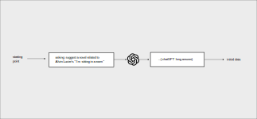

[](https://github.com/karnpapon/pdqbp/actions/workflows/run.yml)

**pdqbp** (probabilistic-determinism's-quirk-based procedures) is a fully automated procedures. to explore, critic, thought-provoking underlying layers of large language model, reflect in digital form.

partially, draw an inspiration from [ChatGPT Is a Blurry JPEG of the Web](https://www.newyorker.com/tech/annals-of-technology/chatgpt-is-a-blurry-jpeg-of-the-web), [Cybernetics](http://zimmer.csufresno.edu/~johnca/spch100/11-2-cybernetics.htm) and [Alvin Lucier's](https://en.wikipedia.org/wiki/Alvin_Lucier) best known work [ "I'm sitting in a room" ](https://www.youtube.com/watch?v=fAxHlLK3Oyk), where he recording himself narrating a text, and then playing the tape recording back into the room, re-recording it. The new recording is then played back and re-recorded. Eventually the words become unintelligible, replaced by the characteristic resonant frequencies of the room itself.[¹](https://books.google.co.th/books?id=I0F13e62idIC&pg=PA281&redir_esc=y#v=onepage&q&f=false)

# how it works.



```
[ karnpapon ]:  suggest a novel related to Alvin Lucier's "I'm sitting in a room"
```

```
[ ai ] > One possible novel inspired by Alvin Lucier's "I'm sitting in a room" is a science fiction story that explores the consequences of an advanced technology that allows people to record and manipulate their own thoughts and memories.

In this novel, the protagonist is a scientist named Anna who develops a new device that can extract, amplify, and re-record the brainwaves of a person in real-time. Inspired by Lucier's experiment, Anna decides to test her invention on herself, recording her own thoughts and playing them back repeatedly in the same room.

As she listens to the recordings, Anna notices that her thoughts and memories become distorted, fragmented, and eventually lose their coherence. She starts to experience strange sensations and emotions, as if her mind was being pulled apart and reassembled by the device.

As the experiment continues, Anna realizes that the device has a mind of its own, and that it is actively shaping her thoughts and feelings in unexpected ways. She becomes trapped in a loop of self-referential thoughts, unable to distinguish between reality and illusion.

Desperate to break free from the device's grip, Anna embarks on a journey to discover the origins of the technology and the people who created it. Along the way, she encounters other individuals who have also been affected by the device, and who are struggling to regain control of their own minds.

Ultimately, Anna learns that the device was not designed for personal use, but rather as a weapon of mass manipulation. In a dramatic climax, she must confront the mastermind behind the device and make a choice that will determine the fate of humanity.
```


- an initial http request will be made to create image from initial text.
- the generated image will then be fed to ImageCaption model.
- the generated text(image caption) and pre-configred parameters will then be used as a payload to feed into text-2-image model via WebSocket.
- the cycle keeps going every day, via Github Action.
- the output will be re-interpreted, manipulated, enhanced by the feedback loop, overtime.
- the current result is determined by previous data.

## notes

generated image name use `ISO 8601` standard for the sake of management.

## resources

- https://huggingface.co/spaces/SRDdev/Image-Caption
- https://huggingface.co/spaces/albarji/mixture-of-diffusers
- https://www.newyorker.com/tech/annals-of-technology/chatgpt-is-a-blurry-jpeg-of-the-web
