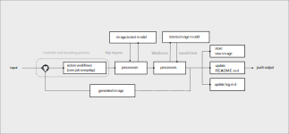

tinou is a fully automated procedures. to explore, critic, thought-provoking underlying layers of large language model, and so-called Artificial Intelligence in general, reflect in digital form.

partially, draw an inspiration from [ChatGPT Is a Blurry JPEG of the Web](https://www.newyorker.com/tech/annals-of-technology/chatgpt-is-a-blurry-jpeg-of-the-web), [Cybernetics](http://zimmer.csufresno.edu/~johnca/spch100/11-2-cybernetics.htm) and [Alvin Lucier's](https://en.wikipedia.org/wiki/Alvin_Lucier) best known work [ "I'm sitting in a room" ](https://www.youtube.com/watch?v=fAxHlLK3Oyk), where he recording himself narrating a text, and then playing the tape recording back into the room, re-recording it. The new recording is then played back and re-recorded. Eventually the words become unintelligible, replaced by the characteristic resonant frequencies of the room itself.[¹](https://books.google.co.th/books?id=I0F13e62idIC&pg=PA281&redir_esc=y#v=onepage&q&f=false)

# how it works.

- an initial http request will be made to create image from initial text.
- the generated image will then be fed to ImageCaption model.
- the generated text(image caption) and pre-configred parameters will then be used as a payload to feed into text-2-image model via WebSocket.
- the cycle keeps going every day, via Github Action.
- the output will be re-interpreted, manipulated, enhanced by the feedback loop, overtime.
- the current result is determined by previous data.

## notes

generated image name use `ISO 8601` standard for the sake of management.

## resources

- https://huggingface.co/spaces/SRDdev/Image-Caption
- https://huggingface.co/spaces/albarji/mixture-of-diffusers
- https://www.newyorker.com/tech/annals-of-technology/chatgpt-is-a-blurry-jpeg-of-the-web
